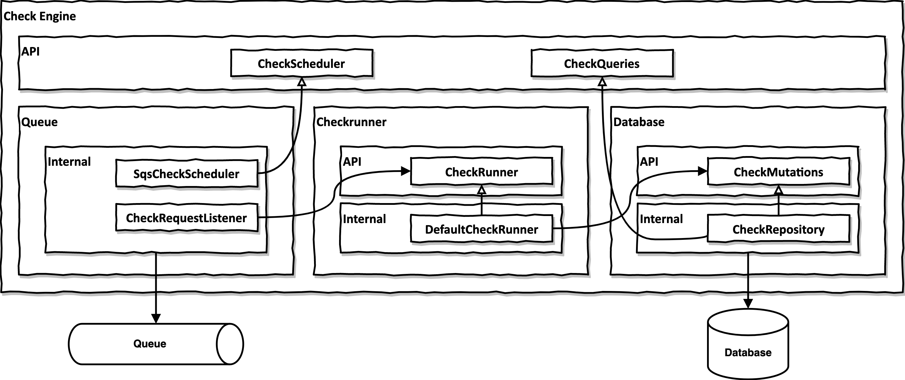

# Component-based architecture example

This repo is an example for a component-based architecture with Kotlin / Java as outlined in these resources:

- [Clean Architecture Boundaries with Spring Boot and ArchUnit](https://reflectoring.io/java-components-clean-boundaries/) (blog article)
- [Let's build components, not layers](https://www.youtube.com/watch?v=-VmhytwBZVs) (talk at [Spring I/O 2019](https://2019.springio.net/))

## Rules of component architecture

These are the rules of a component-based architecture as used in this example codebase:

- A component consists of a set of classes in a dedicated package that defines its namespace.
- A component has a dedicated `api` and `internal` package.
- Any class in an `api` package may be consumed by the outside world.
- Any class in an `internal` package may only be consumed by other classes in that package (i.e. they may not be consumed by the outside world).
- A component may contain sub components in its `internal` package. Each sub component needs to live in its own unique package.

## Example component

This codebase contains an example component called [check-engine](components/check-engine). This check engine is a fully functioning (if simple) component that is responsible for executing arbitrary checks against a given web page. A check may be something like "check if the web page https://foo.bar has valid HTML" or "check if the web page https://abc.def has proper SEO tags".

The API of the component provides the following functionality:
- Schedule a check for asynchronous execution (see `CheckScheduler`).
- Query for the results of one or more checks (see `CheckQueries`).

The check engine component is made up of three sub components:

- **queue**: This sub component interfaces with a queue to schedule checks for asynchronous implementation. This component implements the `CheckScheduler` API of the parent component.
- **database**: This sub component interfaces with a database to store and retrieve the check results. This component implements the `CheckQueries` API of the parent component.
- **checkrunner**: This sub component is responsible for executing scheduled checks asynchronously and storing the results in the database. It does not implement any of the parent component's API. The checkrunner component looks for `CheckExecutor` implementations in the Spring application context and runs each of those checks on any check that is being scheduled.

Each component (the main component and the sub components) have their own Spring `@Configuration` class that pulls in all the Spring beans it needs to work. This allows us to create a Spring context on each level of the component tree, should we need it to write integration tests. 

## Validating the component architecture

If we follow the component-based approach outlined above, we can very easily validate these dependencies with this rule:

> No classes that are outside of an "internal" package should access a class inside of that "internal" package.

We can use [ArchUnit](https://www.archunit.org/) to test our codebase against this rule automatically. See [InternalPackageTest](server/src/test/kotlin/io/reflectoring/components/InternalPackageTest.kt). 

If we follow the conventions of naming internal packages properly, _we can use this one test to validate the component architecture of the whole project_. New components will automatically be included in this test as they are added to the codebase.

Try introducing an invalid dependency and then run the `InternalPackageTest` and witness it failing :).

## Working with the example 

### Requirements
- JDK17 or above
- Docker

### Commands
All commands are to be run from the main folder of this project.

| Command                       | Description                                                                                            |
|-------------------------------|--------------------------------------------------------------------------------------------------------|
| `./gradlew build`             | builds the example project                                                                             |
| `./gradlew bootRun`           | runs the Spring Boot app (⚠️currently not working, because the datasource is not configured correctly) |
| `./gradlew generateJooq`      | generated the JOOQ data access classes from the Flyway scripts                                         |
| `./gradlew composeDownForced` | removes the PostgreSQL Docker image used by JOOQ (run this when you get Flyway errors)                 |

## Discussion of this example codebase

Some points to note about this example codebase:

- The `server` Maven module contains a Spring Boot application that pulls in all the components as dependencies.
- The `components` folder contains a Maven module for each component (although, there currently is only one top-level component).
- In this codebase, the `check-engine` component lives in its own Maven module. We could just as well have chosen to include all the code into a single Maven module, as long as the component has its own unique package name. Putting a component into its own Maven module makes the component boundaries more distinct, however.
- This codebase is using Kotlin. It works in pretty much the same way in a Java codebase.
- An important aspect of component boundaries is that components don't share a database. If they share a database, they are coupled via the data layer, which very quickly leads to a tight coupling between components in all the layers. In the example code, the sub component defined through the package `io.reflectoring.components.checkengine.internal.database` is the only component with direct access to the check engine's database tables.
- This example uses Flyway to create and update the required database schema (see the [common/database](common/database) Maven module). This module includes the database scripts for ALL components (even though this example repo only includes a single component named `check-engine`). That means all components would share a single database schema, but would work on separate database tables. There are other options that allow for a higher degree of separation between components' data (schema-per-component, database-per-component, ...).
- This example is using JOOQ for the data access layer, taking advantage of its source generation feature:
  - During the build, the [common/database](common/database) module spins up a PostgreSQL Docker container. 
  - Flyway then generates a database schema on that PostgreSQL instance from the [database scripts](common/database/src/main/resources/db).
  - JOOQ then analyzes the schema and generates data classes for each table in the schema.
  - The data access layers of our components then use these classes to access the database. This makes sure that the classes are always in sync with the database schema.